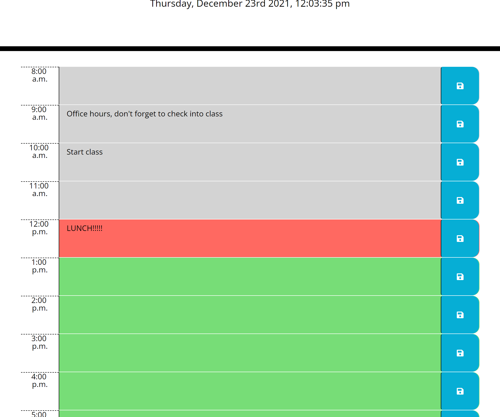

# unitFiveScheduler

[Here is a link to the deployed page](https://amber-robeck.github.io/unitFiveScheduler/ "Day scheduler")

----

## Day Scheduler

#### Welcome to the organized life! This day planner/scheduler will allow you to input new schedule items within each hour block and save them to the page by clicking on the save button. The hour blocks will change colors according to the current time. 
----
On this page you will find:
* hour time blocks displaying times from 8:00am - 5:00pm 
* a real time clock display in the header of page keeping real time using moment.js
* a save button which saves user input to local storage and the time block display
* color changing time blocks depending on current time (gray for past, red for present and green for future events)
* a reset button to reset ALL page display and also ALL local storage

This site is using:
* jQuery
* Bootstrap
* Moment.js
* Font-Awesome
* GoogleFonts

##### This page was made for school, started with most of the html and css already created. I modified html to add time blocks and added script.js.